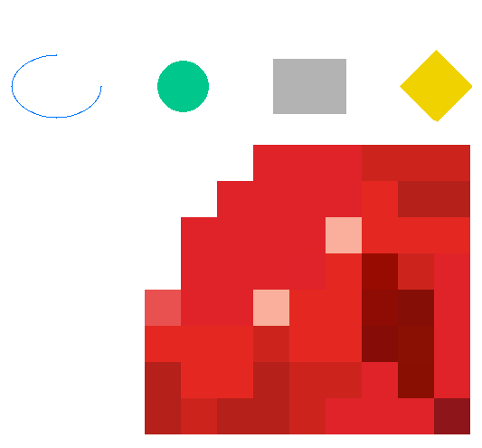
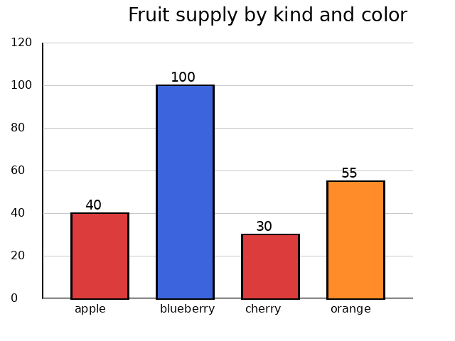
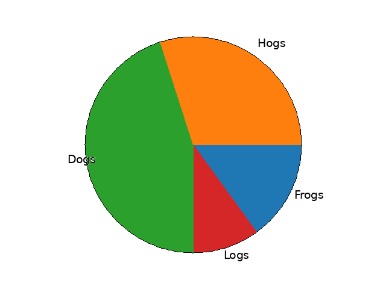
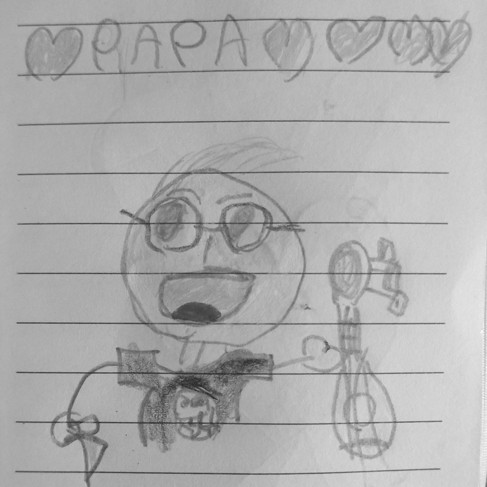
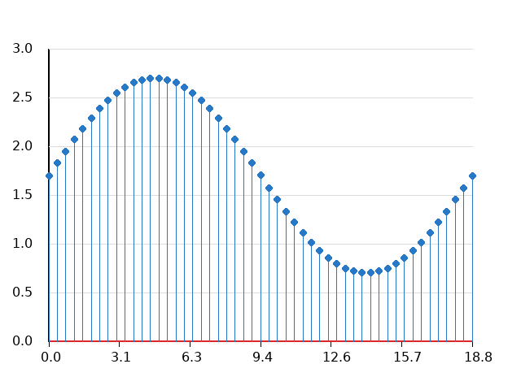
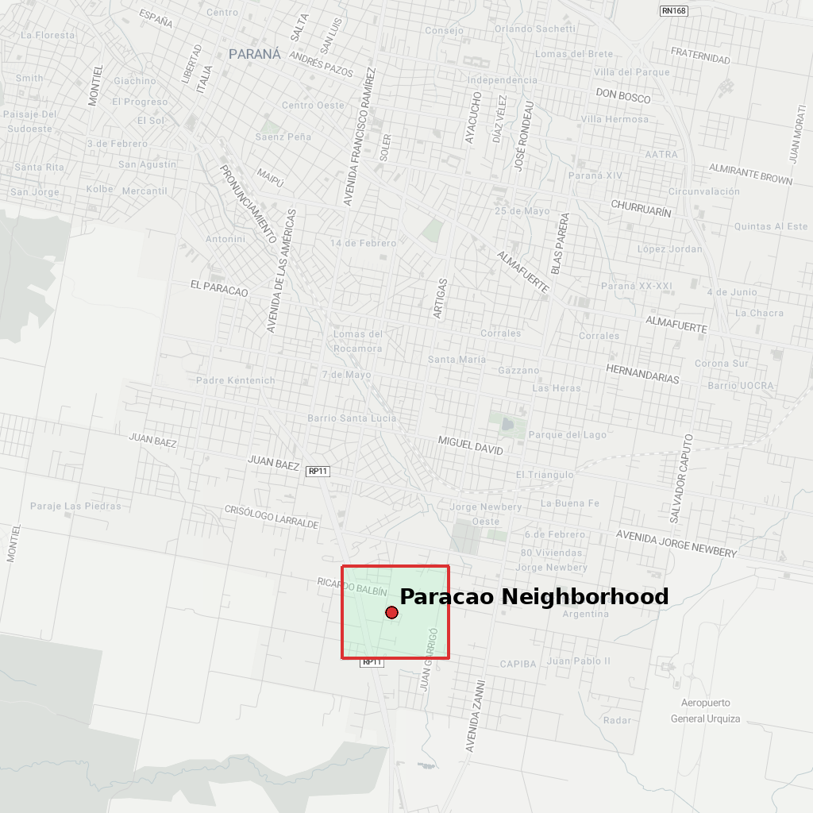

# Ruby Libgd

<p align="center">
  <a href="https://rubystacknews.com">
    
  </a>
  <a href="https://x.com/ruby_stack_news">
    
  </a>
  <a href="https://www.linkedin.com/in/germ%C3%A1n-silva-56a12622/">
    
  </a>
</p>

<p align="right">
  
</p>

## Library Status


| Implemented | Implemented | Coming Next |
| :--: | :--: | :--: |
|  |  |  |
|  |  |  |
|   |  |  |

**Note:** The images shown in Table 1, along with the code used to generate them, are available in the `examples/` folder.

# Native GD bindings for modern Ruby

## What is ruby-libgd?

ruby-libgd is a modern native Ruby binding to the GD Graphics Library, providing Ruby with a fast, embeddable, server-side graphics engine.

It enables Ruby to generate images, charts, dashboards, GIS tiles, and scientific graphics without spawning external processes.

## 🐧Installation (Debian / Ubuntu /Dockerfile)

`gem install ruby-libgd`

System dependencies:

`apt install -y libgd-dev pkg-config`

---

## 🍎 macOS (Intel & Apple Silicon)

ruby-libgd is a native extension and depends on libgd, which must be installed via Homebrew.

Install libgd

```bash
brew install gd
```
Verify Homebrew’s install path:

```bash
brew --prefix gd
```

Typical values:
Apple Silicon (**M1 / M2 / M3**): /opt/homebrew

Intel Macs: /usr/local

### Install ruby-libgd

Apple Silicon (**M1 / M2 / M3**)

Homebrew installs libraries into **/opt/homebrew**, which Ruby’s native extension builder does not detect automatically.

## Install using:

```bash
gem install ruby-libgd -- --with-gd-dir=/opt/homebrew
```

## Intel macOS

```bash
gem install ruby-libgd
```

---

## 📚 Documentation

- 🇬🇧 **English**: https://ggerman.github.io/ruby-libgd/en/
- 🇯🇵 **日本語**: https://ggerman.github.io/ruby-libgd/jp/

---

## Examples:

All runnable examples live in:

examples/
  basics/
  image_processing/
  charts/
  images/

Each Ruby script in examples/ generates an image in examples/images/.


## Links

GitHub: https://github.com/ggerman/ruby-libgd  
RubyGems: https://rubygems.org/gems/ruby-libgd  
Article: https://rubystacknews.com/2026/01/05/ruby-can-create-images-again/

---

## Build & Runtime Environment

**ruby-libgd** is developed and tested against **libgd 2.3.3** using a reproducible Docker environment.

This ensures that the native extension is compiled against a known, stable GD ABI and behaves consistently across systems.

Reference **Dockerfile**
```dockerfile
FROM ruby:3.3

RUN apt update && apt -y upgrade
RUN apt install -y \
  libgd-dev \
  libgd3 \
  libgd-tools \
  pkg-config \
  ruby-dev \
  build-essential \
  valgrind

RUN printf "prefix=/usr\n\
exec_prefix=\${prefix}\n\
libdir=\${exec_prefix}/lib/x86_64-linux-gnu\n\
includedir=\${prefix}/include\n\
\n\
Name: gd\n\
Description: GD Graphics Library\n\
Version: 2.3\n\
Libs: -L\${libdir} -lgd\n\
Cflags: -I\${includedir}\n" \
> /usr/lib/x86_64-linux-gnu/pkgconfig/gd.pc

ENV PKG_CONFIG_PATH=/usr/lib/x86_64-linux-gnu/pkgconfig

WORKDIR /app

COPY Gemfile Gemfile.lock ./
RUN bundle install

# Enforce dependency lockfile reproducibility
RUN bundle config --global frozen 1

COPY . .

```

## Why this matters

**ruby-libgd** is a native **C** extension. The exact **libgd** version and build flags directly affect:

- Alpha blending

- Color accuracy

- Filter behavior

- Memory safety


Using a pinned, containerized build environment guarantees that:

- The extension is compiled against libgd 2.3.x

- pkg-config resolves the correct headers and linker flags

- CI, contributors, and users see identical behavior


This is especially important for GIS, map tiles, and image pipelines where pixel-level consistency matters.

## Example:


```Ruby
require "gd"

WIDTH  = 800
HEIGHT = 400

img = GD::Image.new(WIDTH, HEIGHT)

# ----------------------------
# Pastel palette
# ----------------------------
bg_top    = [244, 240, 255]   # lavender
bg_bottom = [230, 248, 255]   # light sky

accent1 = [255, 140, 180]    # pastel pink
accent2 = [120, 200, 255]    # pastel blue
text_main = [60, 70, 120]    # deep indigo
shadow = [180, 190, 220]

# ----------------------------
# Soft gradient background
# ----------------------------
(0...HEIGHT).each do |y|
  t = y.to_f / (HEIGHT - 1)

  r = (bg_top[0] + (bg_bottom[0] - bg_top[0]) * t).to_i
  g = (bg_top[1] + (bg_bottom[1] - bg_top[1]) * t).to_i
  b = (bg_top[2] + (bg_bottom[2] - bg_top[2]) * t).to_i

  img.line(0, y, WIDTH - 1, y, [r, g, b])
end

# ----------------------------
# Floating pastel blobs
# ----------------------------
img.filled_circle(120, 100, 80, accent2)
img.filled_circle(680, 280, 100, accent1)
img.filled_circle(700, 80, 50, [200, 230, 255])

# ----------------------------
# Text
# ----------------------------
font = "/usr/share/fonts/truetype/dejavu/DejaVuSans.ttf"
title_size = 52
subtitle_size = 20

title = "RubyStackNews"
subtitle = "The pulse of the Ruby ecosystem"

# Manual centering
title_x = 80
title_y = 190

# Soft shadow
img.text(title, {
  x: title_x + 2,
  y: title_y + 2,
  size: title_size,
  color: shadow,
  font: font
})

# Main title
img.text(title, {
  x: title_x,
  y: title_y,
  size: title_size,
  color: text_main,
  font: font
})

# Subtitle
img.text(subtitle, {
  x: title_x,
  y: title_y + 45,
  size: subtitle_size,
  color: [100,110,160],
  font: font
})

# ----------------------------
# Call-to-action pill
# ----------------------------
pill_x = 80
pill_y = 260
pill_w = 260
pill_h = 44

img.filled_rectangle(pill_x, pill_y, pill_x + pill_w, pill_y + pill_h, [255,255,255])
img.rectangle(pill_x, pill_y, pill_x + pill_w, pill_y + pill_h, accent2, thickness: 2)

img.text("rubystacknews.com", {
  x: pill_x + 22,
  y: pill_y + 30,
  size: 20,
  color: text_main,
  font: font
})

# ----------------------------
# Save
# ----------------------------
img.save("images/rubystacknews-banner.png")
puts "Saved images/rubystacknews-banner.png"

```

## License

MIT License.
Copyright (c) 2025 Germán Alberto Giménez Silva.
