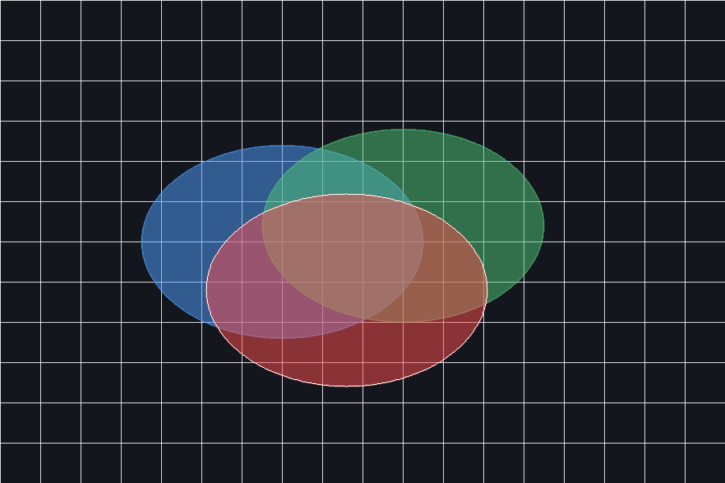

## アンチエイリアスとアルファブレンディング

ruby-libgd は、すべての描画プリミティブに対して
 **トゥルーカラー対応・アルファ対応のアンチエイリアス** をサポートしています。
 これにより、Ruby で滑らかな線、曲線、レイヤー表現、読みやすいテキストを描画できます。

アンチエイリアスは次の要素に適用されます：

- 線（lines）
- 楕円・円（ellipses, circles）
- ポリゴン（polygons）
- 塗りつぶし図形（filled shapes）
- テキスト（text）

内部的には、GD の **トゥルーカラー + アルファブレンディング** パイプラインを使用しています。

------

## アンチエイリアスを有効にする

```
img = GD::Image.new(900, 600)
img.antialias = true
```

有効にすると、すべての描画操作が
 **滑らかなエッジとアルファブレンディング** でレンダリングされます。

------

## 色と透明度

ruby-libgd では色は配列として表現されます：

```
[r, g, b]        # RGB
[r, g, b, a]     # RGBA（a = 0..255）
```

ヘルパーメソッドも用意されています：

```
GD::Color.rgb(255, 0, 0)
GD::Color.rgba(255, 0, 0, 120)
```

これらの値は内部的に GD の
 **トゥルーカラー + アルファ形式** に変換されます。

------

## アンチエイリアスのデモ

この例では、半透明の重なり、滑らかな輪郭線、斜めのラインを描画します。

```
require "gd"

img = GD::Image.new(900, 600)
img.antialias = true

bg    = GD::Color.rgb(20, 22, 30)
grid  = GD::Color.rgba(255,255,255,40)
blue  = GD::Color.rgba(80,160,255,180)
red   = GD::Color.rgba(255,80,80,200)
green = GD::Color.rgba(80,200,120,180)
white = GD::Color.rgb(255,255,255)

img.filled_rectangle(0, 0, 899, 599, bg)

(0..900).step(50) { |x| img.line(x, 0, x, 599, grid) }
(0..600).step(50) { |y| img.line(0, y, 899, y, grid) }

img.filled_ellipse(350, 300, 350, 240, blue)
img.filled_ellipse(500, 280, 350, 240, green)
img.filled_ellipse(430, 360, 350, 240, red)

img.ellipse(430, 360, 350, 240, white)

img.save("antialias_demo.png")
```

------

## なぜアンチエイリアスが重要なのか

アンチエイリアスは次のために不可欠です：

- 曲線のきれいなエッジ
- 滑らかな斜めの線
- 半透明レイヤーの重なり
- 読みやすいラベルとテキスト
- プロフェッショナル品質のビジュアル

このレンダリングパイプラインは
 **libgd-gis の地図描画** にもそのまま使用されています。

